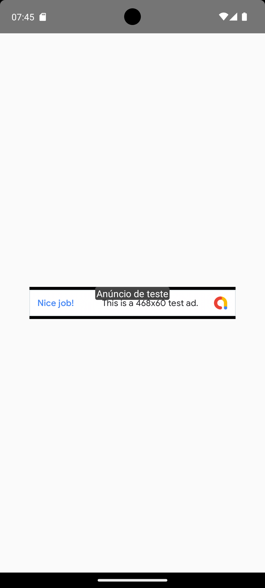
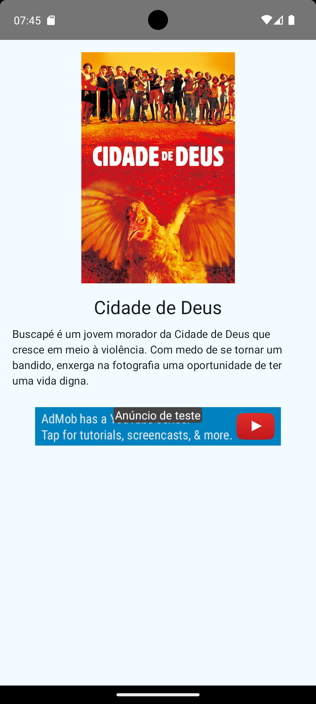

# 🎬 AdMob Banner Kit Consumer

Aplicativo Android de demonstração que utiliza uma biblioteca externa de banners AdMob, com arquitetura moderna baseada em **MVVM**, **Koin**, **Ktor** e **Jetpack Compose**. Exibe anúncios sem comprometer a experiência do usuário ao consumir dados de um filme da API The Movie Database (TMDb).

---

## 🚀 Funcionalidades

- Exibe informações do filme **"Cidade de Deus"**
- Integração com **AdMob Banner Kit** em Compose e XML
- Utiliza shimmer para carregamento elegante
- `AdEventListener` para capturar eventos do ciclo de vida do banner
- Estrutura modular e desacoplada com MVVM

---

## 🧱 Arquitetura

Este projeto segue o padrão **MVVM (Model-View-ViewModel)** com as seguintes camadas:

```
ui/
└── screen/           # Telas Compose + XML

presentation/         # ViewModel com StateFlow

model/                # Repositório e modelos de dados

di/                   # Módulos Koin para injeção de dependência
```

---

## 🧩 Tecnologias e Bibliotecas

| Tecnologia             | Uso                                      |
|------------------------|-------------------------------------------|
| Jetpack Compose        | UI moderna declarativa                    |
| Ktor Client            | Requisições HTTP para API de filmes       |
| Kotlinx Serialization  | Conversão JSON → Kotlin                   |
| Koin                   | Injeção de dependência                    |
| Coroutines / Flow      | Programação assíncrona e reativa          |
| Coil                   | Carregamento de imagem com Compose        |
| Shimmer Compose        | Efeito de carregamento elegante           |
| AdMob Banner Kit       | Exibição de banners com listener          |

---

## 📸 Screenshots

| Compose | XML |
|--------|-----|
|  |  |

---

## 🛠️ Como rodar

### Pré-requisitos

- Android Studio Giraffe ou superior
- Android SDK 33+
- Kotlin 2.1.21+

### Clonar o projeto

```bash
git clone https://github.com/seu-usuario/admob-banner-kit-consumer.git
```

### Configurar API Key

A chave da API do TMDb está temporariamente hardcoded, mas é recomendado extrair para um arquivo `local.properties`:

```properties
TMDB_API_KEY=your_key_here
```

---

## 🧪 Teste de Anúncios

O banner AdMob pode ser visualizado nas telas:

- `ComposeBannerScreen.kt`
- `XMLBannerActivity.kt`

Ambas utilizam `AdEventListener` para registrar o ciclo de vida do banner (Loaded, Failed, Clicked, etc).

---

## 🤝 Créditos

- TMDb API: https://www.themoviedb.org/documentation/api
- Google AdMob: https://developers.google.com/admob/android
- Ktor: https://ktor.io/
- Koin: https://insert-koin.io/
- Coil: https://coil-kt.github.io/coil/
- Shimmer Compose: https://github.com/valentinilk/shimmer-compose

---

## 📝 Licença

MIT © Raphael — https://github.com/raphael1928